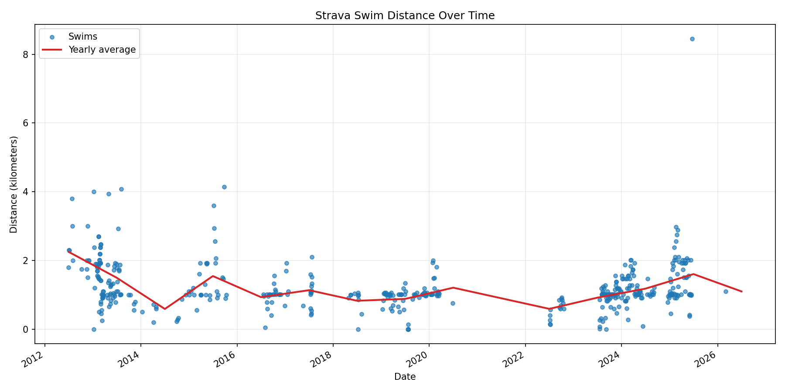
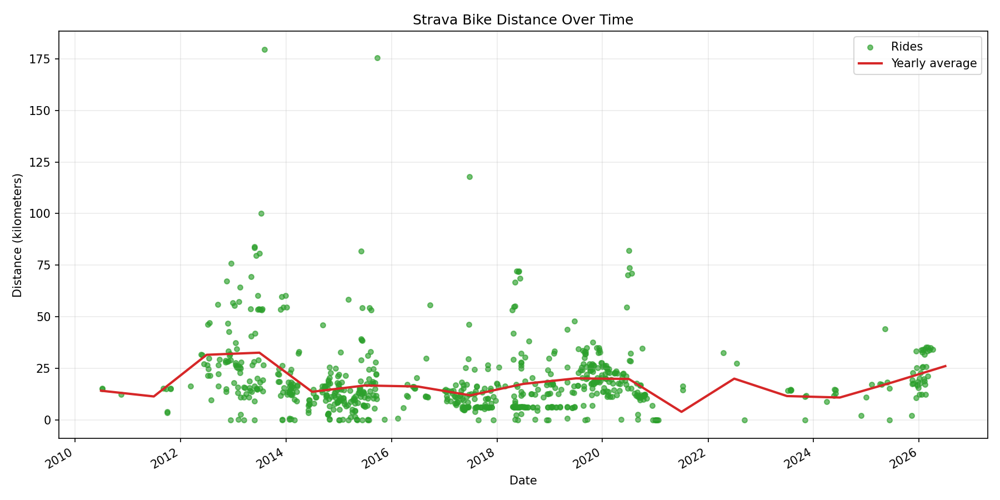
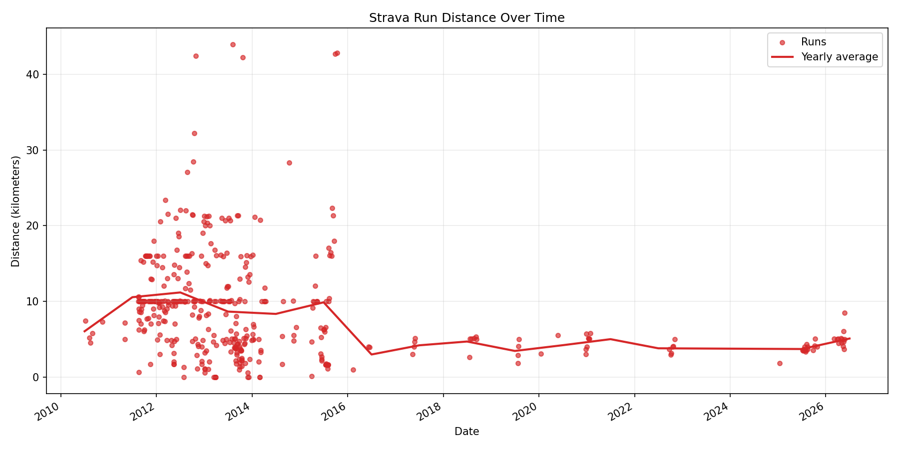
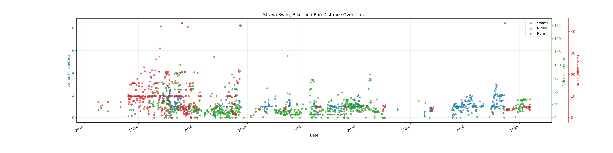

## Swim

{.fitness-chart}

::: {.fitness-note}
Each point is one swim activity, measured in kilometers.
:::

## Bike

{.fitness-chart}

::: {.fitness-note}
Human-powered rides only; e-bike activity types are excluded.
:::

## Run

{.fitness-chart}

::: {.fitness-note}
Runs, trail runs, and virtual runs, measured in kilometers.
:::

## Combined

{.fitness-chart .wide}

::: {.fitness-note}
Three Y axes let swim, bike, and run activity distances scale independently.
:::
