## The Beginning (of the End?)

Way back in February, 2026... In a meeting at work...

- "Chris, can you implement this.  It touches a bunch of things and is going to take you a week or two"
- Sure...

["Codex: Can you implement this feature...?"]{.fragment .typewriter}

[50 mins later...]{.fragment}

["...done"]{.fragment .typewriter-ai}

## Next challenge...

["See this product over here? Go into our source tree, figure out how they implemented that feature and update our product to do the same thing..."]{.typewriter}

&nbsp;

["...done"]{.fragment .typewriter-ai}

## My job changed

- I've written less than 10 lines of code since
- Several PRs per day
- Can't keep up with the AI
- Human reviewers are the bottleneck
- Productivity: 3-5x

## First side project:  ~/.config/nvim {background-color="#161b22"}

- Commandline is king
- No more IDE: lots of terminals

{.slide-image width="85%"}

## Mac
{.slide-image width="85%"}

## Prompts

["Fix my vim config; startup is 2s"]{.typewriter}

["...now starts in 140ms"]{.fragment .typewriter-ai}

["You're an ace developer laughing at my config.  What would you recommend I do to improve?"]{.fragment .typewriter}

["I'll fix these plugins, install this, ..."]{.fragment .typewriter-ai}

["Read my PC config and make this Mac look the same"]{.fragment .typewriter}

["Machine now works the same..."]{.fragment .typewriter-ai}

## Scripting vs Agent
["You might want to make an install script to update your config instead of having me do it"]{.typewriter-ai}

["Why would I need that when I've got you?"]{.fragment .typewriter}

["Because I am expensive glue..."]{.fragment .typewriter-ai}

## Cross-Platform, Agent-Maintained

::: {.columns}
::: {.column width="50%"}

### What it is

- Cross-platform config (Mac + Windows)
- 40+ plugins in Vim
- Shell templates: zsh, PowerShell, Starship, tmux
- One-command bootstrap: `install.sh` / `install.bat`

:::
::: {.column width="50%"}

### Agent-optimized

- `CLAUDE.md` describes the full config for agents
- All keymaps centralized in one file (`keymaps.lua`)
- Duplicate keymap guard catches agent conflicts
- Mason auto-installs LSP servers, formatters, linters

:::
:::


## The Plugin Stack

{.slide-image width="95%"}

## Huge Productivity Boost

- Agents maintain my entire machine & development config 
- `install.sh` and `doctor.sh` 
- I can onboard a brand new machine in minutes
- Cross-platform parity is maintained by agents
- Typical prompt:
- ["Go add quarto to my config at ~/.config/nvim"]{.typewriter}

> My Neovim config was the first spark of an idea... \

## KeyViewer: A Quick Side Project {background-color="#161b22"}

Too many keybindings to remember? Build a viewer.

{.slide-image width="85%"}


## KeyViewer: Rust, one shot

### What it is

- Screen-sized cheat sheet: launch `kv`, see all bindings
- Parses `keys.md` 

["Read my `~/.tmux.conf` and `keymaps.lua` and generate a `keys.md`"]{.typewriter}

## Whole Machine Organisation

::: {.columns}
::: {.column width="50%"}
- PARA system
- A root and branch cleanout of all my machines
- Organisation of my personal information into Drobox/Vault

["Look through my machine, tell me what is old/broken/legacy"]{.fragment .typewriter}

["Nuke 3, 4, 6..."]{.fragment .typewriter}

["Organise all my documents here like this..."]{.fragment .typewriter}
:::

::: {.column width="50%"}
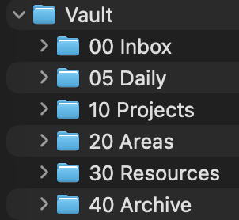{.slide-image width="85%"}
:::
:::

## Obrain: A Second Brain 

- Post a thought to Slack
    - (Your own Slack Instance is free)
- AI enriches it
- Lands in my Obsidian vault on my Mac Mini
- Synced to Dropbox

~3,300 lines of Python. Runs as a macOS daemon. Entirely agent-written.

## Obrain: The Pipeline

{.slide-image width="90%"}

## Obrain: Ingress
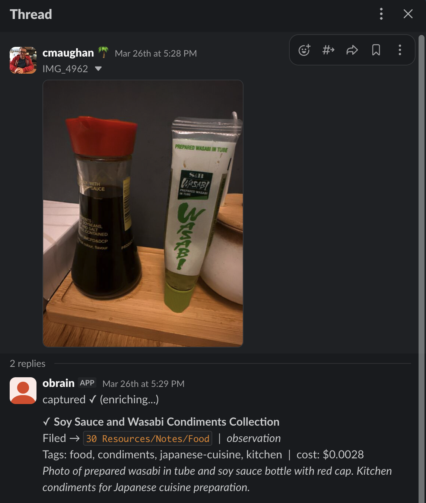{.slide-image}

## Obrain: Beyond Capture

::: {.columns}
::: {.column width="50%"}

### Morning Brief

- Daily at 06:00 via launchd
- Calendar events, stock data, news feeds
- Web search 'Vault Interests'

:::
::: {.column width="50%"}

### Vault Query

- Prefix a Slack with `?`
- Claude searches my vault
- My whole vault: an agent query

:::
:::

## Obrain: Daily Brief
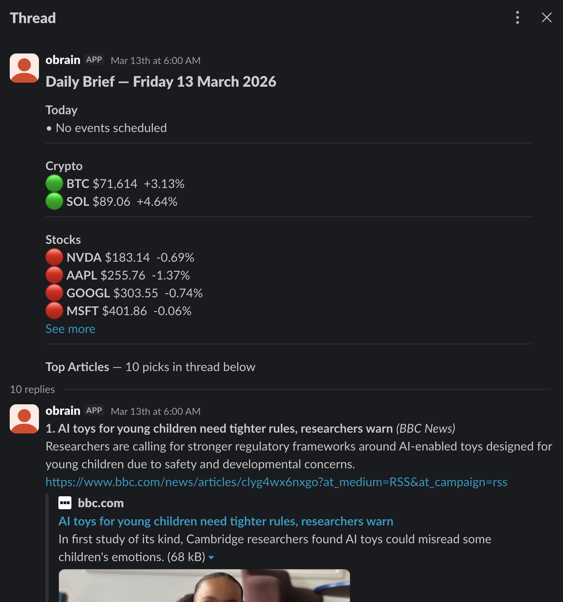{.slide-image}

## Anything is possible...

What to build?

## Initial Motivation
... 3D + Editor...


## Live Coding: Zep & VkLive

{.slide-image width="100%"}

A multi-year text editor project, embedding a vim and notepad-like editor in a 3D view

## {.section-divider background-color="#161b22"}

::: {style="text-align: center; padding-top: 2em;"}
<h2>Dark Factory Development</h2>
My agentic workflow so far...
:::

## Guiding Principles
- Help the Human as much as possible
- Help the Agent as much as possible
- Keep the Agent busy
- Drain the swamp
    - No tech debt

## Testing Infrastructure

-  **Unit tests** - a natural by-product
- **Render snapshot tests** -- pixel-level diff against golden references
- **LLVM coverage**, **Analysis**, **Memory**, ?
- **Smoke tests**, **Integration**, Blessed outputs

["I can see there is a line through the emoji here, that doesn't look right..."]{.fragment .typewriter-ai}

["The blessed image has drifted by 1%; but that's OK; I just changed rendering - I'll bless a new image"]{.fragment .typewriter-ai}

## GitHub CI Pipeline

::: {.columns}
::: {.column width="50%"}

- **Build** 
- **Format**
- **ASan** -- AddressSanitizer + LeakSanitizer
- **Coverage** -- LLVM instrumented build + lcov export
- **SonarCloud** -- static analysis and code quality
- **Docs** -- auto-generate and publish documentation

:::
::: {.column width="50%"}

```
workflows/
├── build.yml       # Compile
├── format.yml      # clang-format gate
├── asan.yml        # Sanitizers
├── coverage.yml    # LLVM coverage
├── sonar.yml       # Static analysis
└── docs.yml        # Documentation
```

:::
:::

## Agent-Generated Documentation

::: {.columns .tight}
::: {.column width="25%"}

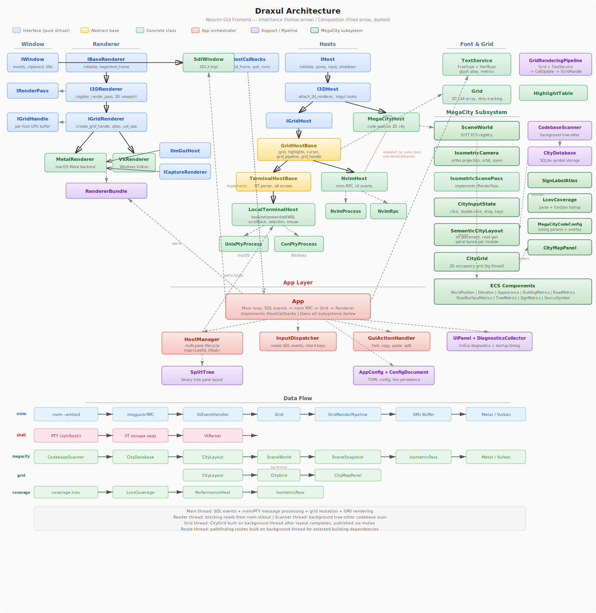{.slide-image}

:::
::: {.column width="25%"}

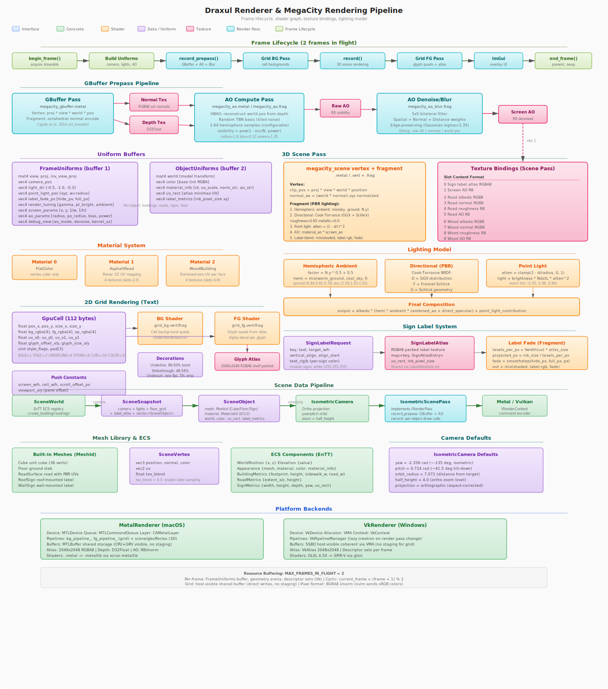{.slide-image}

:::
::: {.column width="25%"}

{.slide-image}

:::
::: {.column width="25%"}

{.slide-image}

:::
:::

## Multi-Agent Code Reviews

Three agents review the same codebase independently:

```
plans/reviews/
├── review-latest.claude.md
├── review-latest.gemini.md
├── review-latest.gpt.md
└── review-consensus.md       ← synthesized
```

- Each agent finds different classes of issues
- The consensus step is synthesis, not concatenation
- Agreements reinforce confidence; disagreements surface real tradeoffs

## Review Flow 

{.slide-image width="90%"}


## Review prompt - stored
[...Look at the separation of modules and the general layout. Look for bad code smells, or things that will make it harder for multiple agents to work on the codebase. Do a thorough review. Look for testing holes, and for code that is not clean or easy to maintain. Look for opportunities to separate concerns and make things modular...]{.typewriter}

## Markdown Kanban

{.slide-image width="90%"}

## Human in the Loop

{.slide-image width="90%"}

## Obsidian Kanban
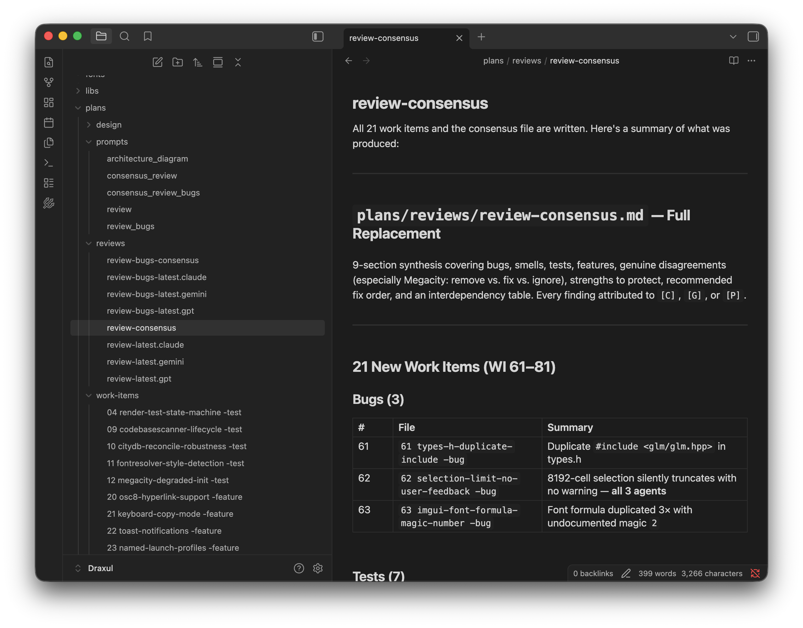{.slide-image width="90%"}

## Parallel Agents via Worktrees

```bash
# Each agent gets an isolated git worktree
Agent(isolation: "worktree", prompt: "Fix the PTY EINTR bug...")
Agent(isolation: "worktree", prompt: "Refactor render passes...")
Agent(isolation: "worktree", prompt: "Add chord keybindings...")
```

- Each agent works on an isolated copy of the repo
- No conflicts during execution
- A full context window per agent
- The integrating agent merges all diffs with full context
- Even overlapping changes can be reconciled intelligently

## {.section-divider background-color="#161b22"}

::: {style="text-align: center; padding-top: 2em;"}
<h2>The Project - Draxul 🩸</h2>
(I'm crap at names - but crap names have available domains)
:::

## At first - a replacement for nvim-qt


## SDL3 + GPU Rendering
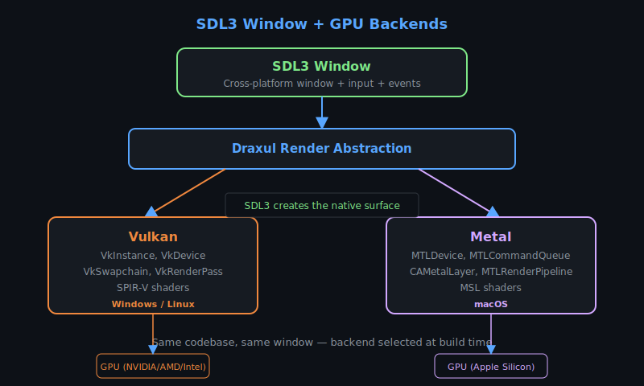

## The working version

{.slide-image}

## Getting Ambitious

::: {.columns}
::: {.column width="55%"}
- ConPTY, PTY
- Windows, Mac, Linux
- Powershell, Cmd, Bash, WSL, ZSH
- Ghostty/tmux/iTerm/Win Terminal
- Splits and Tabs
- Review/Fix/Refactor/Feature

:::
::: {.column width="45%"}
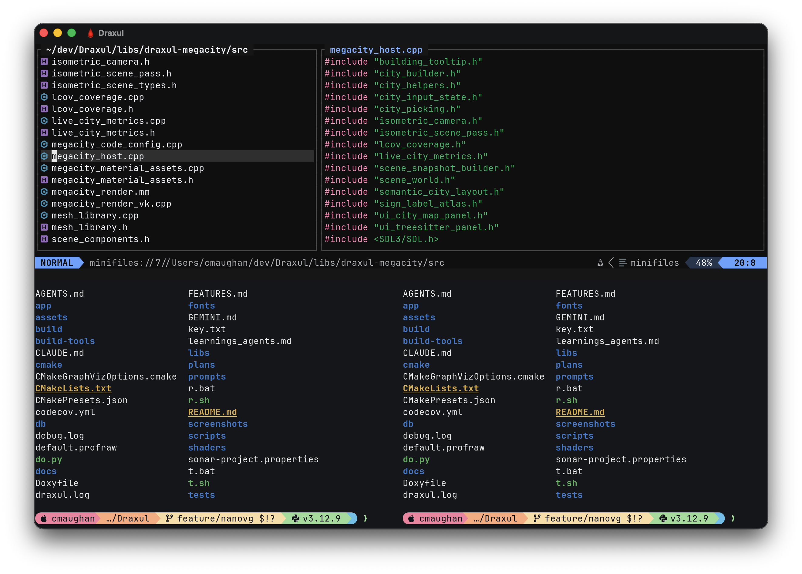{.slide-image}
:::
:::

## Managing Complexity

By this point I was more interested in the orchestration problem than the app I was building...

## Mega City Code : A Complexity Metaphor

{.slide-image width="90%"}

> An old idea who's time may have come
> https://wettel.github.io/download/Wettel08b-wasdett.pdf

## Mega City Code
- An extra 1-2 weeks to add the city(!)
- Metal & Vulkan, Mac, PC (Linux...)
- Treesitter, SQLite DB
- A high-end game engine:
    - HDR pipe, AA, Tone Mapped
    - Point and CSM shadows
    - Ambient Occlusion
    - Forward+ (ish)
    - A* path finding
    - Programmer/Procedural/Free art ;)
- VR one day?

## ImGui

- Tweakables 
- Hook up every parameter to UI, config
- Visualize everything
- Debug Scenes, performance checks, etc.
- Essential for graphics

## ImGui {background-color="#0d1117"}
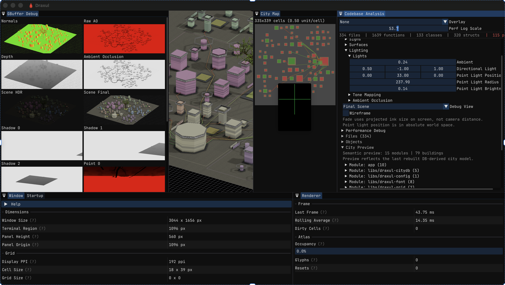{.slide-image width="95%"}

## App Connections

{.slide-image width="90%"}

## Live Perf

{.slide-image}

## Tooltip Traces

{.slide-image width="90%"}

## Multi-Host Split Panes

{.slide-image}

## Coverage Overlay

{.slide-image width="90%"}

LCOV coverage imported from CI, Yellow = Covered

# We are all 100x developers

- 3 part time weeks == 3 full time years
- As new tools, orchestration software and better agents arrive, this trend will increase
- Dark Factory is inevitable for many software shops
- Test the product not the contents
- Build it, throw it away, do something new (that's Monday...)

## Real Costs (not existential ones...)

- Claude £100/Month
- Codex £20/Month (with a promotional quota reset)
- Gemini Free (code reviews, a bit of dev)
- A Mac Mini (not necessary)
- So this whole project ~£100
- Who knows how pricing will shake out?
- The time to build is now

# Various Learnings

## Today's agents are not yesterday's...

- Forget CoPilot
- Codex 5.4 (/effort default/xtreme?)
- Claude Opus (effort auto/max/high?)
- Gemini (?)

## Personal Opinion

- Codex 5.4 is a better programmer (but only just)
- Claude Opus is better at big picture stuff
- Claude has a better personality
- Gemini is good, but slow
- The Codex app is very good
    - OpenAI are cranking right now

## Don't wish for it, just ask

- If you can think it, AI can do it. 
- A common refrain: "Have you asked Codex?... doh!"

## Anything is possible 

{.slide-image width="90%"}

## Onboard the Agents

- Prime the context window
- /init 
- Skills can help
- Sub folder agent files
- Markdown...

## Markdown everything

- Plans
- Prompts
- Kanban/Work
- Documentation
- Diagrams
- Skills are just markdown files...
- Agents.md, Claude.md, Gemini.md
- Learnings.md
- This-thing-I-worked/decided/created/thought.md
- Agent: reconcile these files...

## Build tools first

- Help the agent 'see'; whatever that means for you
- Nail down the build, test cycle
- Validate everything you can automatically
- Never ask the agent to change something
- Make it a UI button/editor instead.
- Bake the 'Debug Dashboard' in
- CI/Github is no longer hard

## Python is your friend

- Make a scripts folder
- Never do anything twice
- Tokens aren't cheap: Python scripts are free
- I have a central 'do.py' that can do anything

## Context window

::: {.columns}
::: {.column width="50%"}
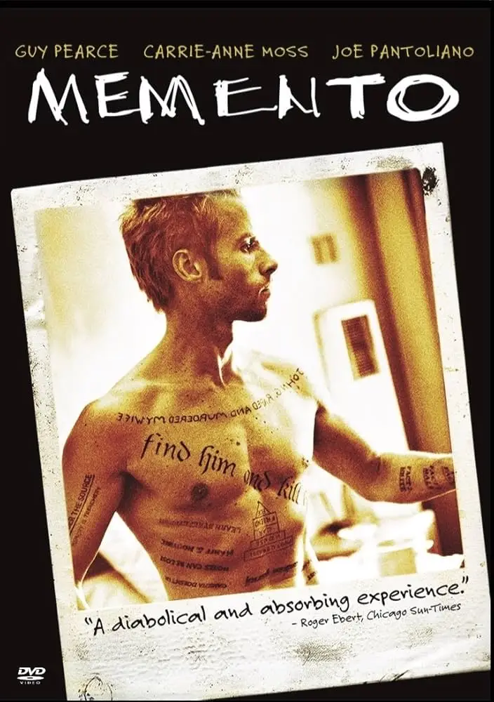{.slide-image}
:::
::: {.column width="50%"}
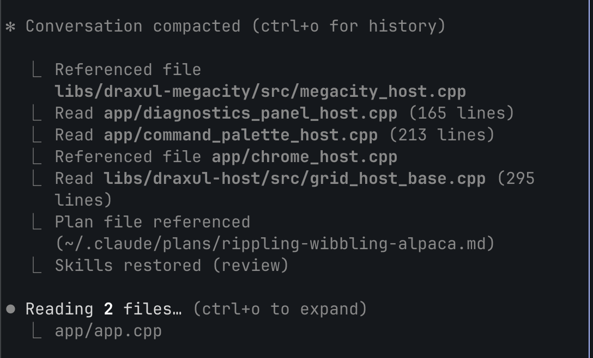{.slide-image}
:::
:::

## Context window

- Don't worry about compaction
- Optimised by the AI companies
- Clear it for new tasks
- I rarely manage it
- Bigger not necessarily better

## The Agent is your best teacher

- It will explain the code to you
- This is the best way to find code smells
- Talk to it and you'll often catch it out
- Some coding decisions are pragmatic instead of correct
- Watch it work; you often see these go past
- It's a fun game: "How does this _really_ work?"

## Code Management

- I rarely look at code
- I want the 'big picture'
- I look at outcomes, inputs, tests
- Never go back; never revert

## Human effort level == Task effort level

- Easy jobs: "Go do it..."
- Medium jobs: "What would you do here...?  Fine, do it"
- Hard jobs: "Plan this, write a work item, lets discuss, etc."

## Challenges

- Easy to get lost
    - Different machines, agents, branches
    - Untested big features?!
- The agent is pragmatic
    - _You_ set the direction
    - It will lie by omission about what's done

## Specific Challenges

- The renderer was not 'optimal'
    - Single buffered
    - One big draw batch
    - Too much state
- The hierarchy of the windows was weird
    - Agent did was was easy, not elegant
- Agent can make a AAA game engine
    - ...but has trouble drawning a button

## Challenges

::: {.columns}
::: {.column width="60%"}
- Token anxiety is a thing
- Existential threat
    - We are more aware
- The 5 hour window is annoying
    - 'Insert your credit card here'
- Prioritise sleep/health
- Claude mobile is the devil incarnate

:::
::: {.column width="40%"}
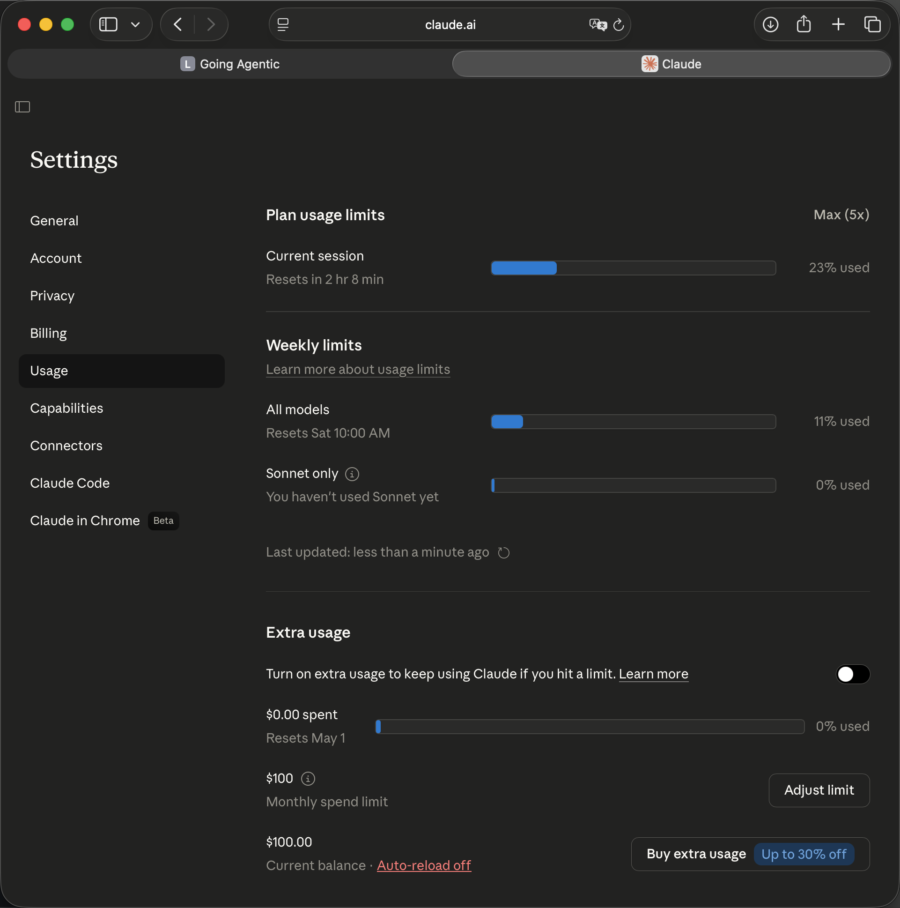{.slide-image}
:::
:::

## Build what you know

- It is much easier
- Hard to know if a thing is right if you never did it yourself
- My previous experience: 3D hardware engineer, live coding projects, text editors, neovim, treesitter, sqlite3 
- We still have value; we are orchestrators now

```{=html}
<script>
document.addEventListener('DOMContentLoaded', function() {
  // Store original text; only clear non-fragment typewriters
  var twSel = '.typewriter, .typewriter-ai';
  document.querySelectorAll(twSel).forEach(function(el) {
    el.dataset.text = el.textContent;
    if (!el.classList.contains('fragment')) {
      el.textContent = '';
    }
  });

  function typeText(el) {
    var text = el.dataset.text || el.textContent;
    el.dataset.text = text;
    el.textContent = '';
    el.classList.add('typing');
    var i = 0;
    var interval = setInterval(function() {
      el.textContent = text.slice(0, ++i);
      if (i >= text.length) {
        clearInterval(interval);
        el.classList.remove('typing');
        el.style.borderRightColor = 'transparent';
      }
    }, 15);
  }

  function isTypewriter(el) {
    return el.classList.contains('typewriter') || el.classList.contains('typewriter-ai');
  }

  function typeNonFragments(slide) {
    slide.querySelectorAll('.typewriter:not(.fragment), .typewriter-ai:not(.fragment)').forEach(typeText);
  }

  typeNonFragments(Reveal.getCurrentSlide());

  Reveal.on('slidechanged', function(event) {
    typeNonFragments(event.currentSlide);
  });

  Reveal.on('fragmentshown', function(event) {
    event.fragments.forEach(function(frag) {
      if (isTypewriter(frag)) {
        typeText(frag);
      }
    });
  });
});
</script>
```


## Thank You {background-color="#0d1117"}

::: {style="text-align: center; font-size: 1.4em; margin-top: 1em;"}
[github.com/cmaughan/Draxul](https://github.com/cmaughan/Draxul)
:::

::: {style="text-align: center; margin-top: 2em; color: #8b949e;"}
Built with Claude Code, Codex, and Gemini

(this presentation too...)
:::
