## The Beginning (of the End?)

Cast your mind back to February; the last time I wrote any code...

- I'm in a meeting
- "Chris, can you do this work.  It touches a bunch of things and is going to take you a week or two"

["Codex: Can you implement this feature...?"]{.fragment .typewriter}

## Next challenge...

["See this product over here? Go into our source tree, figure out how they implemented that feature and update our product to do the same thing..."]{.typewriter}

&nbsp;

[...done]{.fragment .typewriter-ai}

## My job changed

- I've written less than 10 lines of code since
- Several PRs per day
- Can't keep up with the AI
- Human reviewers are the bottleneck
- Productivity curve: 3-5x

## First side project:  ~/.config/nvim {background-color="#161b22"}

- Commandline is king
- No more IDE: lots of terminals

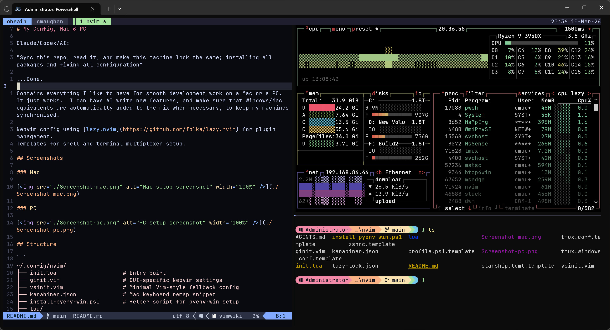{.slide-image width="85%"}

## Mac
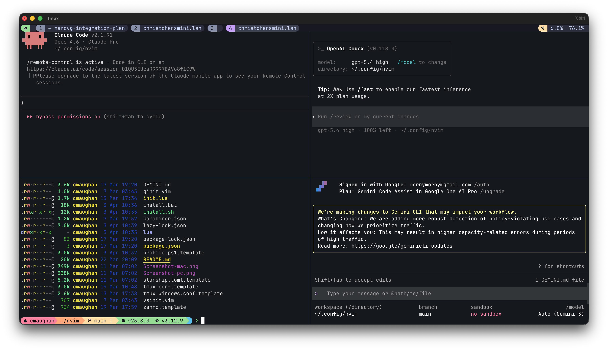{.slide-image width="85%"}

## Prompts

["Fix my vim config; startup is 2s"]{.typewriter}

[...now starts in 140ms]{.fragment .typewriter-ai}

["You're an ace developer laughing at my config.  What would you recommend I do to improve?"]{.fragment .typewriter}

["Fix these plugins, install this, ..."]{.fragment .typewriter-ai}

["Read my PC config and make this Mac look the same"]{.fragment .typewriter}

["Machine now works the same..."]{.fragment .typewriter-ai}

## Scripting vs Agent
["You might want to make an install script to update your config instead of having me do it"]{.typewriter-ai}

["Why would I need that when I've got you?"]{.fragment .typewriter}

["Because I am expensive glue..."]{.fragment .typewriter-ai}

## Cross-Platform, Agent-Maintained

::: {.columns}
::: {.column width="50%"}

### What it is

- Cross-platform config (Mac + Windows)
- 40+ plugins in Vim 
- Shell templates: zsh, PowerShell, Starship, tmux
- One-command bootstrap: `install.sh` / `install.bat`

:::
::: {.column width="50%"}

### Agent-optimized

- `CLAUDE.md` describes the full config for agents
- All keymaps centralized in one file (`keymaps.lua`)
- Duplicate keymap guard catches agent conflicts
- Mason auto-installs LSP servers, formatters, linters

:::
:::


## The Plugin Stack

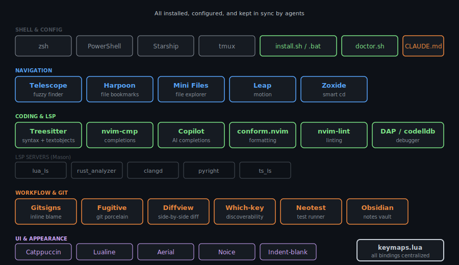{.slide-image width="95%"}

## Huge Productivity Boost

- Agents maintain my entire machine & development config 
- `install.sh` and `doctor.sh` 
- I can onboard a brand new machine in minutes
- Cross-platform parity is maintained by agents
- Typical prompt:
- ["Go add quarto to my config at ~/.config/nvim"]{.typewriter}

> My Neovim config was the first spark of an idea... \

## KeyViewer: A Quick Side Project {background-color="#161b22"}

Too many keybindings to remember? Build a viewer.

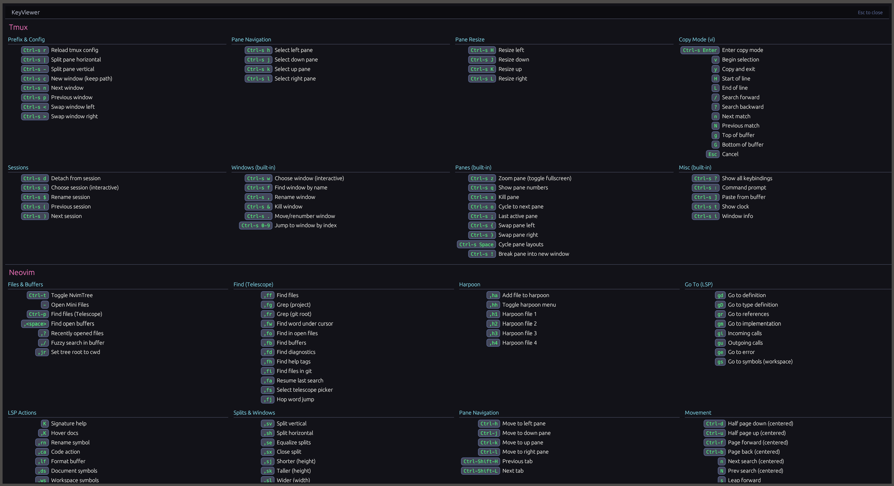{.slide-image width="85%"}


## KeyViewer: Rust, one shot

### What it is

- One-shot overlay: launch `kv`, see all bindings
- Parses a `keys.md` 

["Read my `~/.tmux.conf` and `keymaps.lua` and generate a `keys.md`"]{.typewriter}

## Whole Machine Organisation

::: {.columns}
::: {.column width="30%"}
- PARA system
- A root and branch cleanout of all my machines
- Organisation of my personal information into Drobox/Vault

["Look through my machine, tell me what is old/broken/legacy"]{.fragment .typewriter}

["Nuke 3, 4, 6..."]{.fragment .typewriter}

["Organise all my documents here like this..."]{.fragment .typewriter}
:::

::: {.column width="70%"}
{.slide-image width="85%"}
:::
:::

## Obrain: A Second Brain 

- Post a thought to Slack
- AI enriches it. 
- It lands in my Obsidian vault
- Mac Mini Desktop, synced to Dropbox

~3,300 lines of Python. Runs as a macOS daemon. Entirely agent-written.


## Obrain: The Pipeline

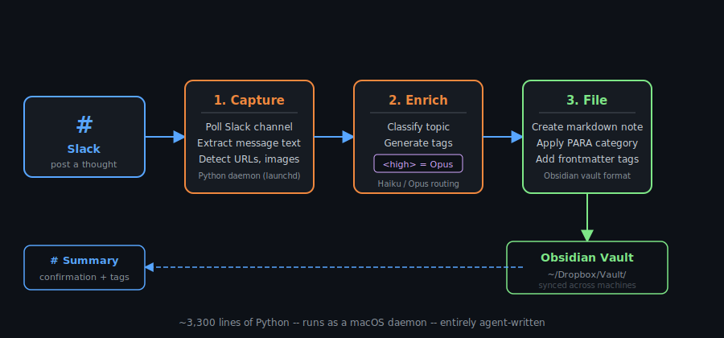{.slide-image width="90%"}


## Obrain: Beyond Capture

::: {.columns}
::: {.column width="50%"}

### Morning Brief

- Daily at 06:00 via launchd
- Calendar events, stock data, news feeds
- Personalized to my interests

:::
::: {.column width="50%"}

### Vault Query

- Prefix a Slack with `?`
- Claude searches my vault 
- My whole vault: an agent query 

:::
:::

> The best second brain is one you never have to think about.

---

## A bigger project

{.slide-image}


## Live Coding
... 3D + Editor...

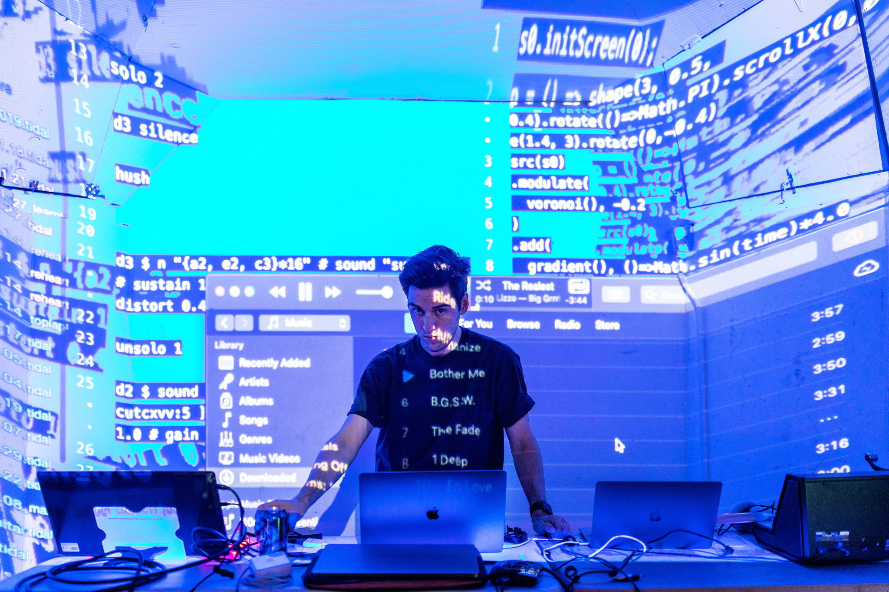

## Live Coding
A previous effort

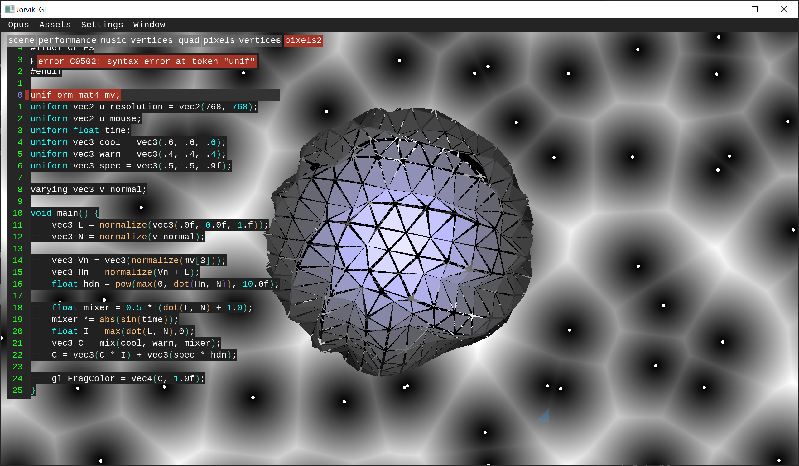

## A replacement for nvim-qt 
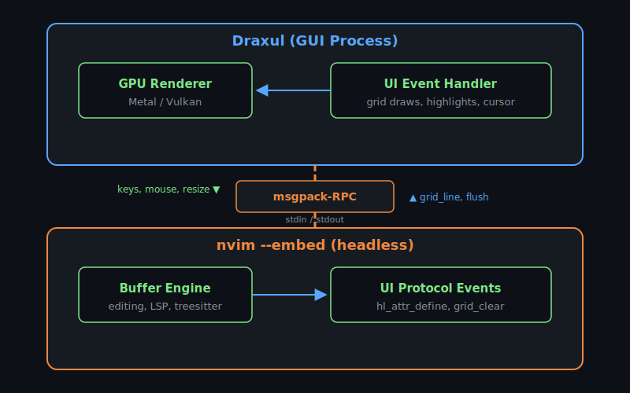

---

## Review System

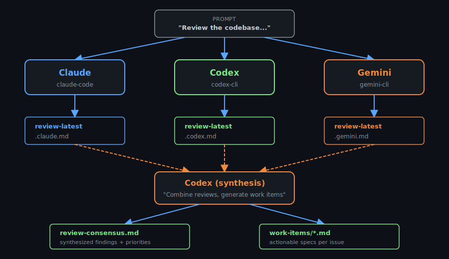{.slide-image width="90%"}

## Review prompt
[...Look at the separation of modules and the general layout. Look for bad code smells, or things that will make it harder for multiple agents to work on the codebase. Do a thorough review. Look for testing holes, and for code that is not clean or easy to maintain. Look for opportunities to separate concerns and make things modular....]{.typewriter}

## Markdown Kanban

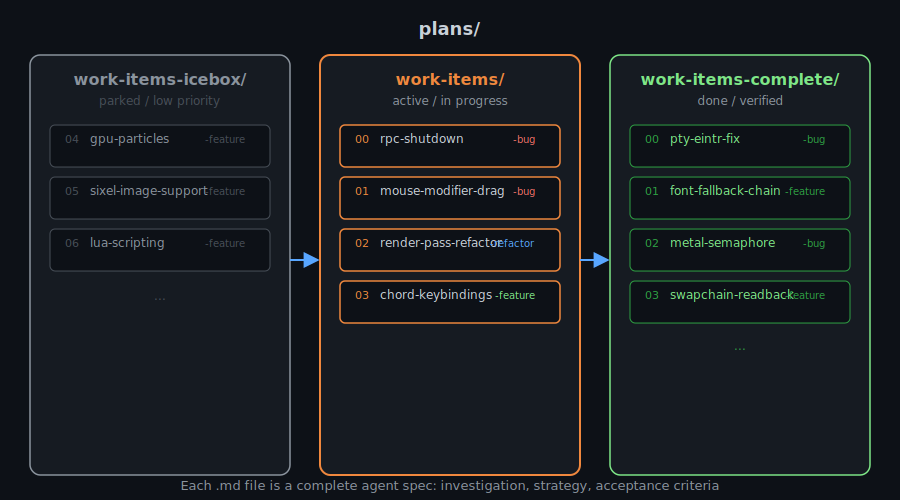{.slide-image width="90%"}

## Human in the Loop

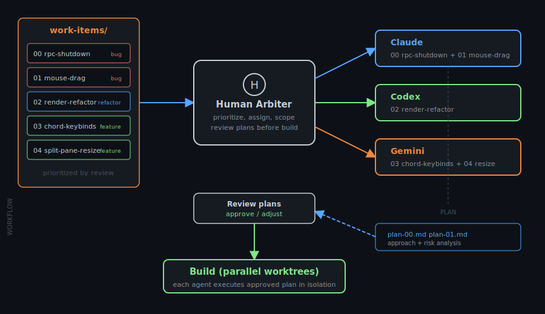{.slide-image width="90%"}

## A full featured neovim GUI! 
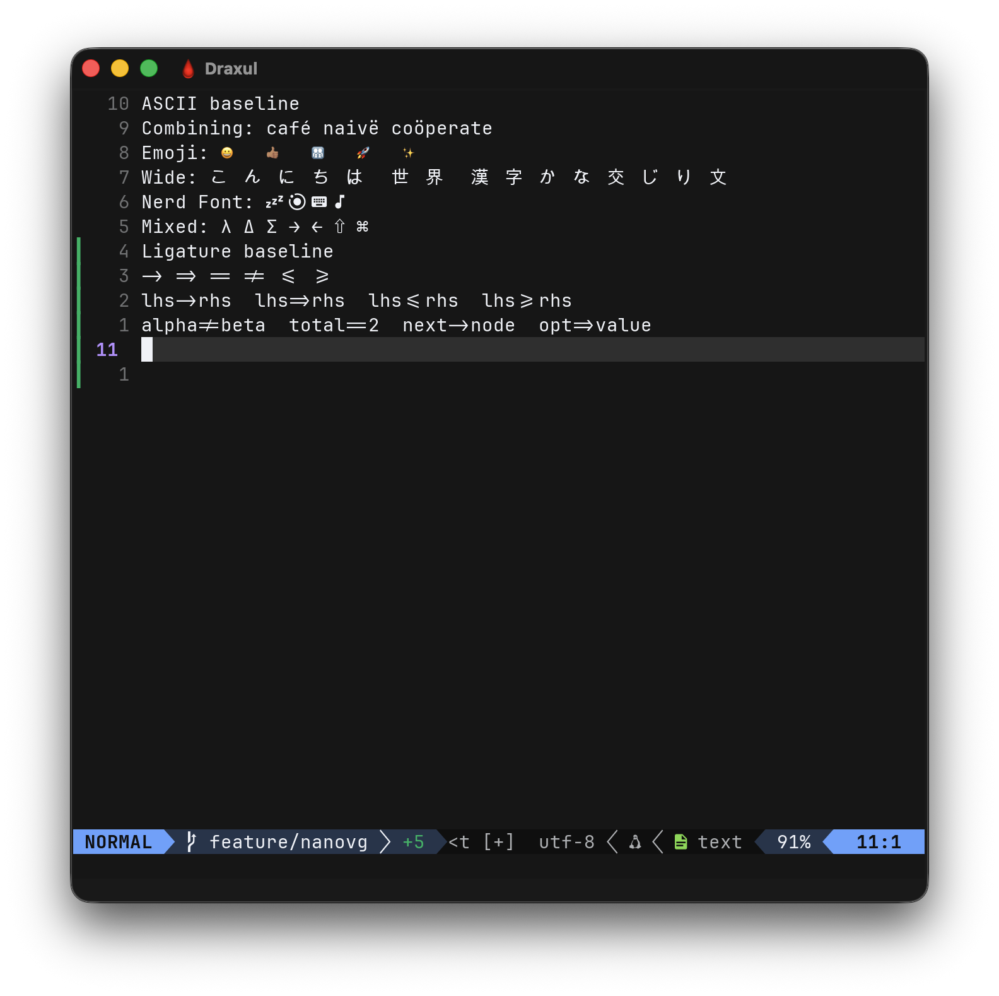{.slide-image}

# Draxul {background-color="#0d1117"}

- **Dark Factory development** across Claude, Codex, and Gemini
- 3 Weeks of part-time work
- A GPU-accelerated Terminal, cross platform (Ghostty-like)
- A 3D city-as-code visualizer
- Metal & Vulkan, Mac, PC (Linux...)
- A high end game engine: 
    - AA
    - HDR Pipeline
    - Point and CSM shadows
    - Ambient Occlusion
    - Programmer art ;)
## What Is Draxul?
::: {.columns}
::: {.column width="50%"}
- Spawns `nvim --embed`, communicates via msgpack-RPC
- Renders terminal grid on GPU (Vulkan/Metal)
- Multi-host: Neovim, Bash, Zsh, PowerShell
- MegaCity: 3D code-city with live perf/coverage overlays
:::
::: {.column width="50%"}
{.slide-image}
:::
:::

::: {.notes}
Hero shot: MegaCity 3D code-city with tooltip inspection panel alongside the Neovim editor.
:::

## Draxul design goals

Small focused libraries wired together by a thin app layer.

::: {.notes}
The library split paid off immediately once multiple agents were working in parallel -- each agent could own a library boundary without stepping on the others.
:::


## MegaCity: Code as a City

{.slide-image width="90%"}

Buildings = classes. Height = function mass. Roads = dependencies.\
Live performance heat and LCOV test coverage overlays.


## Multi-Host Split Panes

::: {.columns}
::: {.column width="50%"}
{.slide-image}
:::
::: {.column width="50%"}
- Neovim, Bash, Zsh, PowerShell hosts
- PTY-based terminal emulation
- Side-by-side 3D city + code editing
- Each pane is an independent host instance
:::
:::


## Test Coverage Overlay

{.slide-image width="90%"}

LCOV coverage imported from CI lights up function layers.\
Covered = hot, uncovered = base color.


---

## {.section-divider background-color="#161b22"}

::: {style="text-align: center; padding-top: 2em;"}
## How I Built It
The agentic development workflow
:::


## The Agent Toolchain

::: {.columns}
::: {.column width="50%"}

### Agents Used

- [Claude Code]{.highlight-blue} -- primary development agent
- [Codex]{.highlight-green} -- parallel worktree tasks
- [Gemini]{.highlight-orange} -- code review + alternative perspectives

:::
::: {.column width="50%"}

### Key Infrastructure

- `CLAUDE.md` as persistent system prompt
- Work items as markdown specs
- Multi-agent reviews with consensus synthesis
- `do.py` as the single entry point

:::
:::


## CLAUDE.md: The System Prompt

The project instructions file that every agent reads on startup:

```markdown
## Build Commands
cmake --preset mac-debug
cmake --build build --target draxul

## Architecture
[dependency graph, data flow, key abstractions]

## Validation Expectations
- Always build and run smoke test before committing
- If you touch renderer code, verify startup

## Known Pitfalls
- Do not include backend-private renderer headers from app/
- Font-size changes must relayout before Neovim acknowledges
```

[This is the most important file in the repo.]{.highlight-green}


## Work Items as Agent Specs

Each task is a markdown file an agent can read and execute:

```
plans/work-items/
├── 00 rpc-shutdown-hardening -bug.md
├── 01 mouse-modifier-drag -bug.md
├── 02 render-pass-refactor -refactor.md
└── 03 chord-keybindings -feature.md
```

- Investigation checkboxes for the agent to tick off
- Fix strategy with specific files and line numbers
- Acceptance criteria that can be verified mechanically
- Appended with which model wrote the spec


## Multi-Agent Code Reviews

Three agents review the same codebase independently:

```
plans/reviews/
├── review-latest.claude.md
├── review-latest.gemini.md
├── review-latest.gpt.md
└── review-consensus.md       ← synthesized
```

- Each agent finds different classes of issues
- The consensus step is synthesis, not concatenation
- Agreements reinforce confidence; disagreements surface real tradeoffs


## Parallel Agents via Worktrees

```bash
# Each agent gets an isolated git worktree
Agent(isolation: "worktree", prompt: "Fix the PTY EINTR bug...")
Agent(isolation: "worktree", prompt: "Refactor render passes...")
Agent(isolation: "worktree", prompt: "Add chord keybindings...")
```

- Each agent works on an isolated copy of the repo
- No conflicts during execution
- The integrating agent merges all diffs with full context
- Even overlapping changes can be reconciled intelligently


## The Integration Moment

> Agent A moved a block of code to a different module.\
> Agent B independently modified that same code at its original location.\
> Neither agent knew what the other was doing.

I reviewed all outputs, applied Agent A's move first, then
**transplanted** Agent B's modification to the new location automatically.

::: {.fragment}
[Don't be afraid to assign overlapping work to parallel agents.]{.highlight-green}\
The integration step is where the orchestrating agent earns its keep.
:::


---

## {.section-divider background-color="#161b22"}

::: {style="text-align: center; padding-top: 2em;"}
## What I Learned
125 lessons distilled
:::


## Lesson: Validation Infrastructure Pays for Itself

::: {.columns}
::: {.column width="50%"}

### What I built

- Swapchain readback for pixel-accurate captures
- Platform-specific reference images
- Diff + bless workflow via `do.py`

:::
::: {.column width="50%"}

### What it caught

- Overlay cell packing bugs
- Font fallback regressions
- Debug overlay interference

:::
:::

> Once a UI project has reliable capture, diff, and bless mechanics,\
> even small regressions become **cheap to spot and cheap to repair**.


## Lesson: Agent Patterns to Watch For

::: {.columns}
::: {.column width="50%"}

### Anti-patterns

- Suggest features in stages, then criticize the result
- Duplicate logic across consumers
- Leave diagnostic logs at INFO level
- Over-abstract for hypothetical requirements

:::
::: {.column width="50%"}

### What works

- Explicit scope upfront prevents suggest-then-criticize
- Compute values once in the data model
- Use DEBUG level -- adding/removing logs is trivial
- Store effective prompts for repeatable generation

:::
:::


## Lesson: The Debugger Wins

> A renderer change caused a startup crash.\
> The agent chose on its own to stop speculating and launch `lldb`.

```
(lldb) run
Process stopped: EXC_BAD_ACCESS
  frame #0: libdispatch semaphore_dispose
```

The debugger immediately showed the crash was in semaphore disposal,\
pointing straight at the new Metal frame-semaphore shutdown logic.

::: {.fragment}
[If a rendering change begins crashing, start the debugger early.]{.highlight-green}\
Get the first real stack trace before iterating further.
:::


## Lesson: User-Supplied Logs Beat Agent Guessing

For renderer bugs, me driving the real interaction path\
and handing over the log is faster than agent-generated reproduction.

- I can drive timing-sensitive UI behavior
- A single log captures the whole failing sequence
- Extra validation output makes logs useful to AI
- The agent maps failures back to concrete code, not vibes

[Invest in targeted logging -- it gives the agent real evidence.]{.highlight-green}


---

## {.section-divider background-color="#161b22"}

::: {style="text-align: center; padding-top: 2em;"}
## The Numbers
:::


## By the Numbers

::: {.columns}
::: {.column width="25%"}
::: {.stat-box}
[8]{.number}
[libraries]{.label}
:::
:::
::: {.column width="25%"}
::: {.stat-box}
[2]{.number}
[GPU backends]{.label}
:::
:::
::: {.column width="25%"}
::: {.stat-box}
[6]{.number}
[host types]{.label}
:::
:::
::: {.column width="25%"}
::: {.stat-box}
[3]{.number}
[AI models]{.label}
:::
:::
:::

::: {.columns style="margin-top: 1em;"}
::: {.column width="25%"}
::: {.stat-box}
[125+]{.number}
[learnings]{.label}
:::
:::
::: {.column width="25%"}
::: {.stat-box}
[50+]{.number}
[work items]{.label}
:::
:::
::: {.column width="25%"}
::: {.stat-box}
[10]{.number}
[render tests]{.label}
:::
:::
::: {.column width="25%"}
::: {.stat-box}
[0]{.number}
[human LOC]{.label}
:::
:::
:::


---

## {.section-divider background-color="#161b22"}

::: {style="text-align: center; padding-top: 2em;"}
## Practical Takeaways
:::


## If You Try Agentic Development

::: {.incremental}
1. **Write a `CLAUDE.md`** -- it's the most leveraged file in the repo
2. **Split into small libraries** -- agents work better with clear boundaries
3. **Work items as markdown specs** -- investigation, strategy, acceptance criteria
4. **Multi-agent reviews** -- different models find different bugs
5. **Parallel worktrees** -- don't serialize what can be parallelized
6. **Validation infrastructure early** -- smoke tests, render snapshots, `do.py`
:::

# Tips

## You're in trouble:

::: {style="text-align: center; font-size: 2em; padding-top: 3em;"}
[Yes, that's a great idea...]{.typewriter}
:::

```{=html}
<script>
document.addEventListener('DOMContentLoaded', function() {
  // Store original text; only clear non-fragment typewriters
  var twSel = '.typewriter, .typewriter-ai';
  document.querySelectorAll(twSel).forEach(function(el) {
    el.dataset.text = el.textContent;
    if (!el.classList.contains('fragment')) {
      el.textContent = '';
    }
  });

  function typeText(el) {
    var text = el.dataset.text || el.textContent;
    el.dataset.text = text;
    el.textContent = '';
    el.classList.add('typing');
    var i = 0;
    var interval = setInterval(function() {
      el.textContent = text.slice(0, ++i);
      if (i >= text.length) {
        clearInterval(interval);
        el.classList.remove('typing');
        el.style.borderRightColor = 'transparent';
      }
    }, 15);
  }

  function isTypewriter(el) {
    return el.classList.contains('typewriter') || el.classList.contains('typewriter-ai');
  }

  function typeNonFragments(slide) {
    slide.querySelectorAll('.typewriter:not(.fragment), .typewriter-ai:not(.fragment)').forEach(typeText);
  }

  typeNonFragments(Reveal.getCurrentSlide());

  Reveal.on('slidechanged', function(event) {
    typeNonFragments(event.currentSlide);
  });

  Reveal.on('fragmentshown', function(event) {
    event.fragments.forEach(function(frag) {
      if (isTypewriter(frag)) {
        typeText(frag);
      }
    });
  });
});
</script>
```

## Learning 1

Today's agents aren't yesterday's agents

- Forget CoPilot
- Codex 5.4 (/effort default/xtreme?)
- Claude Opus (effort auto/max/high?)
- Gemini

## Learning 2

- If you can think it, AI can do it. 
- A common refrain: "Have you asked Codex?"

## Learning 3

- Context is everything.
- /init to onboard an Agent

## Thank You {background-color="#0d1117"}

::: {style="text-align: center; font-size: 1.4em; margin-top: 1em;"}
[github.com/cmaughan/Draxul](https://github.com/cmaughan/Draxul)
:::

::: {style="text-align: center; margin-top: 2em; color: #8b949e;"}
Built with Claude Code, Codex, and Gemini\
100% agentically coded
:::
