## {.quote-only-slide}

<blockquote class="basho-quote">
  <p>“To learn about pine trees, go to the pine tree;<br>to learn of the bamboo, study bamboo.”</p>
  <footer>— Matsuo Bashō</footer>
</blockquote>

## The 1x Developer (Circa 2025)

```{=html}
<svg class="lifecycle-diagram" viewBox="0 0 960 510" role="img" aria-label="The 1x developer lifecycle: maintain Jira, plan, code, test, conduct group review, commit, deploy, and maintain documentation.">
  <ellipse class="cycle-track" cx="480" cy="255" rx="340" ry="205" />

  <polygon class="cycle-arrow" points="-13,-8 11,0 -13,8" transform="translate(610 66) rotate(14)" />
  <polygon class="cycle-arrow" points="-13,-8 11,0 -13,8" transform="translate(794 177) rotate(55)" />
  <polygon class="cycle-arrow" points="-13,-8 11,0 -13,8" transform="translate(794 333) rotate(125)" />
  <polygon class="cycle-arrow" points="-13,-8 11,0 -13,8" transform="translate(610 444) rotate(166)" />
  <polygon class="cycle-arrow" points="-13,-8 11,0 -13,8" transform="translate(350 444) rotate(-166)" />
  <polygon class="cycle-arrow" points="-13,-8 11,0 -13,8" transform="translate(166 333) rotate(-125)" />
  <polygon class="cycle-arrow" points="-13,-8 11,0 -13,8" transform="translate(166 177) rotate(-55)" />
  <polygon class="cycle-arrow" points="-13,-8 11,0 -13,8" transform="translate(350 66) rotate(-14)" />

  <g class="cycle-core" transform="translate(480 255)">
    <circle cx="0" cy="0" r="92" />
    <text class="multiplier" x="0" y="-2">1×</text>
    <text class="core-label" x="0" y="28">DEVELOPER LOOP</text>
  </g>

  <g class="cycle-node" transform="translate(380 17)">
    <rect width="200" height="66" rx="14" />
    <text x="100" y="41">Maintain Jira</text>
  </g>
  <g class="cycle-node" transform="translate(630 85)">
    <rect width="190" height="66" rx="14" />
    <text x="95" y="41">Planning</text>
  </g>
  <g class="cycle-node" transform="translate(720 222)">
    <rect width="190" height="66" rx="14" />
    <text x="95" y="41">Coding</text>
  </g>
  <g class="cycle-node" transform="translate(630 365)">
    <rect width="190" height="66" rx="14" />
    <text x="95" y="41">Testing</text>
  </g>
  <g class="cycle-node" transform="translate(370 430)">
    <rect width="220" height="66" rx="14" />
    <text x="110" y="41">Group Review</text>
  </g>
  <g class="cycle-node" transform="translate(150 365)">
    <rect width="180" height="66" rx="14" />
    <text x="90" y="41">Commit</text>
  </g>
  <g class="cycle-node" transform="translate(50 222)">
    <rect width="180" height="66" rx="14" />
    <text x="90" y="41">Deploy</text>
  </g>
  <g class="cycle-node" transform="translate(130 85)">
    <rect width="220" height="66" rx="14" />
    <text x="110" y="41">Documentation</text>
  </g>
</svg>
```

<p class="loop-caption">(insert your loop here....)</p>

<div class="ai-key" aria-label="Color key: green means no AI, orange means some AI, and red means all AI."><span class="key-item"><span class="key-swatch no-ai"></span>No AI</span><span class="key-item"><span class="key-swatch some-ai"></span>Some AI</span><span class="key-item"><span class="key-swatch all-ai"></span>All AI</span></div>

## The 1x Developer

- Most time coding
- Annoying bits, like Jira & Planning
- Lots of Scripting, Tools: VSCode, Git, etc

##

{.slide-image fig-alt="How to Copy and Paste from ChatGPT"}

<p class="slide-attribution">Attribution: Vecteezy.com</p>

## The 3x Developer {.compact-title}

```{=html}
<svg class="lifecycle-diagram" viewBox="0 0 960 510" role="img" aria-label="The 3x developer lifecycle: planning, coding, testing, and group review use some AI; maintaining Jira, committing, deploying, and documentation do not use AI.">
  <ellipse class="cycle-track" cx="480" cy="255" rx="340" ry="205" />

  <polygon class="cycle-arrow" points="-13,-8 11,0 -13,8" transform="translate(610 66) rotate(14)" />
  <polygon class="cycle-arrow" points="-13,-8 11,0 -13,8" transform="translate(794 177) rotate(55)" />
  <polygon class="cycle-arrow" points="-13,-8 11,0 -13,8" transform="translate(794 333) rotate(125)" />
  <polygon class="cycle-arrow" points="-13,-8 11,0 -13,8" transform="translate(610 444) rotate(166)" />
  <polygon class="cycle-arrow" points="-13,-8 11,0 -13,8" transform="translate(350 444) rotate(-166)" />
  <polygon class="cycle-arrow" points="-13,-8 11,0 -13,8" transform="translate(166 333) rotate(-125)" />
  <polygon class="cycle-arrow" points="-13,-8 11,0 -13,8" transform="translate(166 177) rotate(-55)" />
  <polygon class="cycle-arrow" points="-13,-8 11,0 -13,8" transform="translate(350 66) rotate(-14)" />

  <g class="cycle-core" transform="translate(480 255)">
    <circle cx="0" cy="0" r="92" />
    <text class="multiplier" x="0" y="-2">3×</text>
    <text class="core-label" x="0" y="28">DEVELOPER LOOP</text>
  </g>

  <g class="cycle-node" transform="translate(380 17)">
    <rect width="200" height="66" rx="14" />
    <text x="100" y="41">Maintain Jira</text>
  </g>
  <g class="cycle-node ai-assisted" transform="translate(630 85)">
    <rect width="190" height="66" rx="14" />
    <text x="95" y="41">Planning</text>
  </g>
  <g class="cycle-node ai-assisted" transform="translate(720 222)">
    <rect width="190" height="66" rx="14" />
    <text x="95" y="41">Coding</text>
  </g>
  <g class="cycle-node ai-assisted" transform="translate(630 365)">
    <rect width="190" height="66" rx="14" />
    <text x="95" y="41">Testing</text>
  </g>
  <g class="cycle-node ai-assisted" transform="translate(370 430)">
    <rect width="220" height="66" rx="14" />
    <text x="110" y="41">Group Review</text>
  </g>
  <g class="cycle-node" transform="translate(150 365)">
    <rect width="180" height="66" rx="14" />
    <text x="90" y="41">Commit</text>
  </g>
  <g class="cycle-node" transform="translate(50 222)">
    <rect width="180" height="66" rx="14" />
    <text x="90" y="41">Deploy</text>
  </g>
  <g class="cycle-node" transform="translate(130 85)">
    <rect width="220" height="66" rx="14" />
    <text x="110" y="41">Documentation</text>
  </g>
</svg>
```

<p class="loop-caption">(insert your loop here....)</p>

<div class="ai-key" aria-label="Color key: green means no AI, orange means some AI, and red means all AI."><span class="key-item"><span class="key-swatch no-ai"></span>No AI</span><span class="key-item"><span class="key-swatch some-ai"></span>Some AI</span><span class="key-item"><span class="key-swatch all-ai"></span>All AI</span></div>

## The 3x Problem

<p class="big-idea">The coding got faster<br><span class="accent-orange">The rest of it didn't (mostly...)</span></p>

## The 3x Developer

- Most corporate devs are here right now (?)
- Planning with AI help
- Coding with Cursor, Codex, or Claude
    - From the most to least expensive task
- An `AGENTS.md`
- Tried a skill or two: `/superpowers`, `/grill-me`, etc.
- Used `/review` or CodeRabbit, GitHub, Copilot

## Basic Tooling - An Easy Win

<div class="tooling-frame">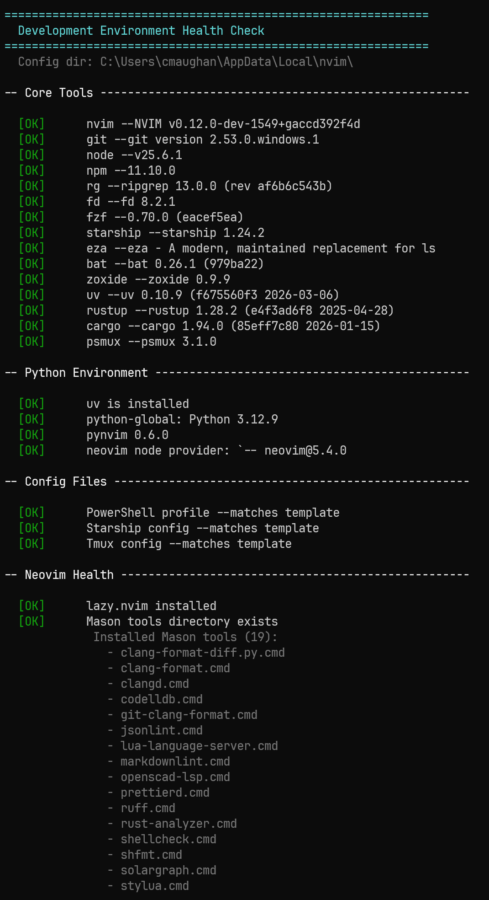</div>

## Small Wins Matter

:::: {.columns .tight}

::: {.column width="42%"}

- Fixing your workflow is a prompt away

:::

::: {.column width="68%"}

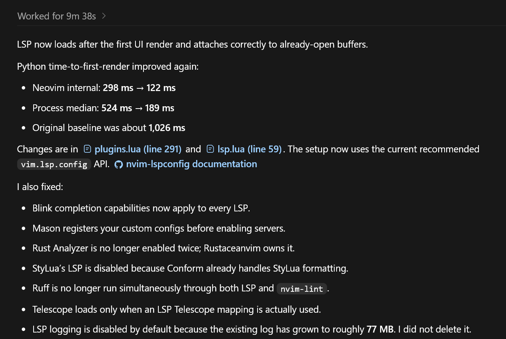{.slide-image fig-alt="A Codex result showing substantial Neovim startup improvements"}

:::

::::

## `AGENTS.md` : "Agentic Employee 101"

- Explains where everything is and what it does
- Build, test, review commands
- Every agent the same starting point
- Subdirectories too
- "Prefer integration tests, vertical-slice tests, and smoke tests that exercise
  real feature boundaries over narrow unit tests with little incremental value."
- `/init`
- Delete it?  Update it?

<p class="big-idea">Don't prompt the rules, record them</p>

## Skills : "Encode Process"

<div class="skill-repos">
  <a class="skill-repo" href="https://github.com/mattpocock/skills" target="_blank" rel="noopener noreferrer">
    <span class="skill-repo-name">Matt Pocock — Skills for Real Engineers</span>
    <span class="skill-repo-description">Small, practical and composable engineering skills.</span>
    <code>github.com/mattpocock/skills</code>
  </a>

  <a class="skill-repo" href="https://github.com/obra/superpowers" target="_blank" rel="noopener noreferrer">
    <span class="skill-repo-name">Superpowers</span>
    <span class="skill-repo-description">A complete agentic development workflow built from reusable skills.</span>
    <code>github.com/obra/superpowers</code>
  </a>

  <a class="skill-repo" href="https://github.com/VoltAgent/awesome-agent-skills" target="_blank" rel="noopener noreferrer">
    <span class="skill-repo-name">Awesome Agent Skills</span>
    <span class="skill-repo-description">A curated collection from development teams and the community.</span>
    <code>github.com/VoltAgent/awesome-agent-skills</code>
  </a>
</div>

## The 10x Developer

~~~{=html}
<svg class="lifecycle-diagram" viewBox="0 0 960 510" role="img" aria-label="The 10x developer lifecycle: all responsibilities use some AI, including maintaining Jira, planning, coding, testing, group review, committing, deploying, and documentation.">
  <ellipse class="cycle-track" cx="480" cy="255" rx="340" ry="205" />

  <polygon class="cycle-arrow" points="-13,-8 11,0 -13,8" transform="translate(610 66) rotate(14)" />
  <polygon class="cycle-arrow" points="-13,-8 11,0 -13,8" transform="translate(794 177) rotate(55)" />
  <polygon class="cycle-arrow" points="-13,-8 11,0 -13,8" transform="translate(794 333) rotate(125)" />
  <polygon class="cycle-arrow" points="-13,-8 11,0 -13,8" transform="translate(610 444) rotate(166)" />
  <polygon class="cycle-arrow" points="-13,-8 11,0 -13,8" transform="translate(350 444) rotate(-166)" />
  <polygon class="cycle-arrow" points="-13,-8 11,0 -13,8" transform="translate(166 333) rotate(-125)" />
  <polygon class="cycle-arrow" points="-13,-8 11,0 -13,8" transform="translate(166 177) rotate(-55)" />
  <polygon class="cycle-arrow" points="-13,-8 11,0 -13,8" transform="translate(350 66) rotate(-14)" />

  <g class="cycle-core" transform="translate(480 255)">
    <circle cx="0" cy="0" r="92" />
    <text class="multiplier" x="0" y="-2">10×</text>
    <text class="core-label" x="0" y="28">DEVELOPER LOOP</text>
  </g>

  <g class="cycle-node ai-assisted" transform="translate(380 17)">
    <rect width="200" height="66" rx="14" />
    <text x="100" y="41">Maintain Jira</text>
  </g>
  <g class="cycle-node ai-assisted" transform="translate(630 85)">
    <rect width="190" height="66" rx="14" />
    <text x="95" y="41">Planning</text>
  </g>
  <g class="cycle-node ai-assisted" transform="translate(720 222)">
    <rect width="190" height="66" rx="14" />
    <text x="95" y="41">Coding</text>
  </g>
  <g class="cycle-node ai-assisted" transform="translate(630 365)">
    <rect width="190" height="66" rx="14" />
    <text x="95" y="41">Testing</text>
  </g>
  <g class="cycle-node ai-assisted" transform="translate(370 430)">
    <rect width="220" height="66" rx="14" />
    <text x="110" y="41">Group Review</text>
  </g>
  <g class="cycle-node ai-assisted" transform="translate(150 365)">
    <rect width="180" height="66" rx="14" />
    <text x="90" y="41">Commit</text>
  </g>
  <g class="cycle-node ai-assisted" transform="translate(50 222)">
    <rect width="180" height="66" rx="14" />
    <text x="90" y="41">Deploy</text>
  </g>
  <g class="cycle-node ai-assisted" transform="translate(130 85)">
    <rect width="220" height="66" rx="14" />
    <text x="110" y="41">Documentation</text>
  </g>
</svg>
~~~

<p class="loop-caption">(insert your loop here....)</p>

<div class="ai-key" aria-label="Color key: green means no AI, orange means some AI, and red means all AI."><span class="key-item"><span class="key-swatch no-ai"></span>No AI</span><span class="key-item"><span class="key-swatch some-ai"></span>Some AI</span><span class="key-item"><span class="key-swatch all-ai"></span>All AI</span></div>

## Skills: The Basic Structure

```text
my-skill/
├── SKILL.md
├── scripts/
│   └── do_the_work.py
├── references/
└── assets/
```

<p class="plain-note"><code>SKILL.md</code> explains when to use the skill. The supporting files make the work repeatable.</p>

## Warning {.skills-warning-slide}

<div class="skills-warning">
  <p>Skills are like little <span>code bombs</span></p>
  <strong>Check provenence</strong>
</div>

## Warning {.skills-warning-slide}

<div class="skills-warning">
  <p>Skills are <span>restrictive</span></p>
  <strong>They will change agent behavior</strong>
</div>

## Skills save Tokens

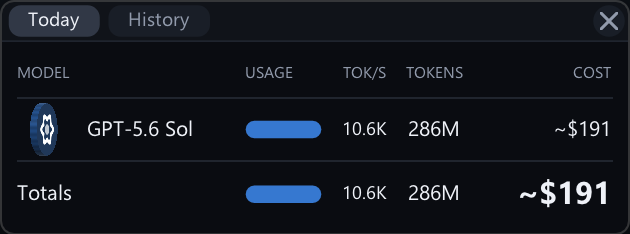{.slide-image fig-alt="Token usage and cost showing approximately 286 million tokens and 191 dollars"}

## Skills: Keep Them Thin

- Small Python scripts do the actual work
- Each thin skill is easy to run, test, and repair
- Repeatable behavior
- Python doesn't burn tokens...
- Explicit triggers: "Use $slack-skill to send `hi folks`"
- Implicit triggers: "Send this message `hi folks`"

## Preflight Skill

- Setup and Auth the MCPs and local services the workflow needs
- Run at startup, and when something fails
- Report status

## Orchestration: It's just a skill

- Delegates to thin skills to do the work
- A recipe book of behaviors/autonomous
- I made: Developer, Reviewer and Submitter

## Skill Hierarchy

```text
project/
└── .agents/
    └── skills/
        └── orchestrator.md
            ├── jira/
            ├── coding/
            ├── slack/
            ├── perforce/       # source control
            ├── swarm/          # reviews
            └── preflight/
```

<p class="plain-note"><code>orchestrator.md</code> chooses the workflow and delegates each step to a child skill.</p>

## Orchestration: Autonomous Developer

- 10: Find a case to work on (auto or directed)
- Take ownership in Jira, In Progress
- Implement it
- Run tests/checks
- Send to Swarm for review
- Open a slack thread with details
- Goto 10

## Orchestration: Autonomous Reviewer

```{=html}
<svg class="reviewer-loop" viewBox="0 0 1000 430" role="img" aria-label="Autonomous reviewer loop. Read Review branches to Fix Obvious Problems or Human Help. Both paths continue to Post Slack and Swarm Update, then Queue Tests, which loops back to Read Review.">
  <defs>
    <marker id="review-arrow" markerWidth="10" markerHeight="10" refX="9" refY="5" orient="auto" markerUnits="userSpaceOnUse">
      <path d="M0,0 L10,5 L0,10 Z" />
    </marker>
    <marker id="review-human-arrow" markerWidth="10" markerHeight="10" refX="9" refY="5" orient="auto" markerUnits="userSpaceOnUse">
      <path d="M0,0 L10,5 L0,10 Z" />
    </marker>
  </defs>

  <path class="review-flow-line" d="M260 105 H348" />
  <path class="review-flow-line human-path" d="M150 140 V240 H348" />
  <path class="review-flow-line" d="M590 105 H650 V142 H698" />
  <path class="review-flow-line" d="M830 175 V335 H602" />
  <path class="review-flow-line" d="M360 335 H16 V105 H28" />

  <g class="review-flow-node" transform="translate(40 70)">
    <rect width="220" height="70" rx="14" />
    <text x="110" y="44">Read Review</text>
  </g>

  <g class="review-flow-node" transform="translate(360 70)">
    <rect width="230" height="70" rx="14" />
    <text x="115" y="30">Fix Obvious</text>
    <text x="115" y="52">Problems</text>
  </g>

  <g class="review-flow-node human-help" transform="translate(360 205)">
    <rect width="230" height="70" rx="14" />
    <text x="115" y="44">Human Help</text>
  </g>

  <g class="review-flow-node" transform="translate(710 105)">
    <rect width="240" height="70" rx="14" />
    <text x="120" y="30">Post Slack &amp;</text>
    <text x="120" y="52">Swarm Update</text>
  </g>

  <g class="review-flow-node" transform="translate(360 300)">
    <rect width="230" height="70" rx="14" />
    <text x="115" y="44">Queue Tests</text>
  </g>
</svg>
```

<p class="big-idea"><span class="accent">Huge Time Saver</span></p>

## Orchestration: Autonomous Reviewer

- 10: Read Swarm (review comments)
- Make a judgement call
- Auto fix, or defer to human
- Fix bug / feature
- Update the review
- Update automated tests
- Post to Swarm and the Slack thread
- Goto 10

## Orchestration: Submitter

- Check the CL tests
- Wait for test validation
- Submit
- Post to Slack thread
- Mark bug complete

## Teach Your Agent To See

- Better coding outcome

## Validation: Image Grabs

- Have a way to capture the UI
- Show the agent how to do that
- Let the agent inspect the real result
- It isn't finished until it is right

## Validation: Image Diffs

- Keep a trusted “before”
- Render the new version
- Highlight only the changed pixels
- Stop if something unexpected moved
- Smoke test step
- It isn't finished until it is right

## Validation: Audio

- Render the reference and the new output
- Compare volume, timing, silence, frequency components...
- `"/goal make them all sound the same"`

## Validation: JSON

- Make a way to dump what's important to you
- Show the agent how to do that
- Let the agent inspect the real result
- Diff against goldens too
- Good technique for understanding shape, location, etc.

## Debug Technique: Dumps

- `"Instrument the app to dump XYZ, I'll run it, you debug it"`
- The agent reads the dump instead of asking you twenty questions
- Fix, rerun, compare
- Very quick way to fix temporal bugs
- Sometimes the agent will just fire up gdb...

## The 10x Developer Target

- Automation is spread throughout
- You still read code
- Your day job is planning, reviewing and testing
- The agent is your intern, doing all the boring bits
- You've taught it how to understand the result
- Never prompt twice for the same thing

## The 100x developer {.compact-title}

~~~{=html}
<svg class="lifecycle-diagram" viewBox="0 0 960 510" role="img" aria-label="The 100x developer lifecycle: coding, group review, committing, and deploying are fully AI-driven; Kanban, planning, testing, and documentation use some AI.">
  <ellipse class="cycle-track" cx="480" cy="255" rx="340" ry="205" />

  <polygon class="cycle-arrow" points="-13,-8 11,0 -13,8" transform="translate(610 66) rotate(14)" />
  <polygon class="cycle-arrow" points="-13,-8 11,0 -13,8" transform="translate(794 177) rotate(55)" />
  <polygon class="cycle-arrow" points="-13,-8 11,0 -13,8" transform="translate(794 333) rotate(125)" />
  <polygon class="cycle-arrow" points="-13,-8 11,0 -13,8" transform="translate(610 444) rotate(166)" />
  <polygon class="cycle-arrow" points="-13,-8 11,0 -13,8" transform="translate(350 444) rotate(-166)" />
  <polygon class="cycle-arrow" points="-13,-8 11,0 -13,8" transform="translate(166 333) rotate(-125)" />
  <polygon class="cycle-arrow" points="-13,-8 11,0 -13,8" transform="translate(166 177) rotate(-55)" />
  <polygon class="cycle-arrow" points="-13,-8 11,0 -13,8" transform="translate(350 66) rotate(-14)" />

  <g class="cycle-core" transform="translate(480 255)">
    <circle cx="0" cy="0" r="92" />
    <text class="multiplier" x="0" y="-2">100×</text>
    <text class="core-label" x="0" y="28">DEVELOPER LOOP</text>
  </g>

  <g class="cycle-node ai-assisted" transform="translate(380 17)">
    <rect width="200" height="66" rx="14" />
    <text x="100" y="41">Kanban</text>
  </g>
  <g class="cycle-node ai-assisted" transform="translate(630 85)">
    <rect width="190" height="66" rx="14" />
    <text x="95" y="41">Planning</text>
  </g>
  <g class="cycle-node ai-driven" transform="translate(720 222)">
    <rect width="190" height="66" rx="14" />
    <text x="95" y="41">Coding</text>
  </g>
  <g class="cycle-node ai-assisted" transform="translate(630 365)">
    <rect width="190" height="66" rx="14" />
    <text x="95" y="41">Testing</text>
  </g>
  <g class="cycle-node ai-driven" transform="translate(370 430)">
    <rect width="220" height="66" rx="14" />
    <text x="110" y="41">Group Review</text>
  </g>
  <g class="cycle-node ai-driven" transform="translate(150 365)">
    <rect width="180" height="66" rx="14" />
    <text x="90" y="41">Commit</text>
  </g>
  <g class="cycle-node ai-driven" transform="translate(50 222)">
    <rect width="180" height="66" rx="14" />
    <text x="90" y="41">Deploy</text>
  </g>
  <g class="cycle-node ai-assisted" transform="translate(130 85)">
    <rect width="220" height="66" rx="14" />
    <text x="110" y="41">Documentation</text>
  </g>
</svg>
~~~

<p class="loop-caption">(insert your loop here....)</p>

<div class="ai-key" aria-label="Color key: green means no AI, orange means some AI, and red means all AI."><span class="key-item"><span class="key-swatch no-ai"></span>No AI</span><span class="key-item"><span class="key-swatch some-ai"></span>Some AI</span><span class="key-item"><span class="key-swatch all-ai"></span>All AI</span></div>

## Dark Factory?

{.slide-image fig-alt="Solar Eclipse"}

<p class="slide-attribution">Attribution: European Space Agency</p>

## The 100x Developer

- Most code is no longer read by a human
- Agents work on the whole problem (autonomously?)
- Parallel workflows, multiple agents
- The code is a black box (agents can test)
- The inputs and outputs are checked by humans and agents
- You are an Architect, an Orchestrator, a Detective

## The Crypto Trilemma (??)

```{=html}
<svg class="trilemma-diagram" viewBox="0 0 960 500" role="img" aria-label="The crypto trilemma: scalability, decentralization, and security.">
  <path class="trilemma-triangle" d="M480 92 L165 400 L795 400 Z" />

  <g class="trilemma-node medium-label" transform="translate(480 92)">
    <circle r="90" />
    <text y="9">SCALABILITY</text>
  </g>

  <g class="trilemma-node long-label" transform="translate(165 400)">
    <circle r="90" />
    <text y="9">DECENTRALIZATION</text>
  </g>

  <g class="trilemma-node" transform="translate(795 400)">
    <circle r="90" />
    <text y="9">SECURITY</text>
  </g>

  <g class="trilemma-core" transform="translate(480 300)">
    <text class="core-kicker" y="-13">THE TRADE-OFF</text>
    <text class="core-message" y="24">You can't maximize all three</text>
  </g>
</svg>
```

## The AI Dev's Trilemma

```{=html}
<svg class="trilemma-diagram" viewBox="0 0 960 500" role="img" aria-label="The AI delivery trilemma: speed, architecture, and features.">
  <path class="trilemma-triangle" d="M480 92 L165 400 L795 400 Z" />

  <g class="trilemma-node" transform="translate(480 92)">
    <circle r="90" />
    <text y="9">SPEED</text>
  </g>

  <g class="trilemma-node medium-label" transform="translate(165 400)">
    <circle r="90" />
    <text y="9">ARCHITECTURE</text>
  </g>

  <g class="trilemma-node" transform="translate(795 400)">
    <circle r="90" />
    <text y="9">FEATURES</text>
  </g>

  <g class="trilemma-core" transform="translate(480 300)">
    <text class="core-kicker" y="-13">THE TRADE-OFF</text>
    <text class="core-message" y="24">You can't maximize all three</text>
  </g>
</svg>
```

## Consistent Tooling

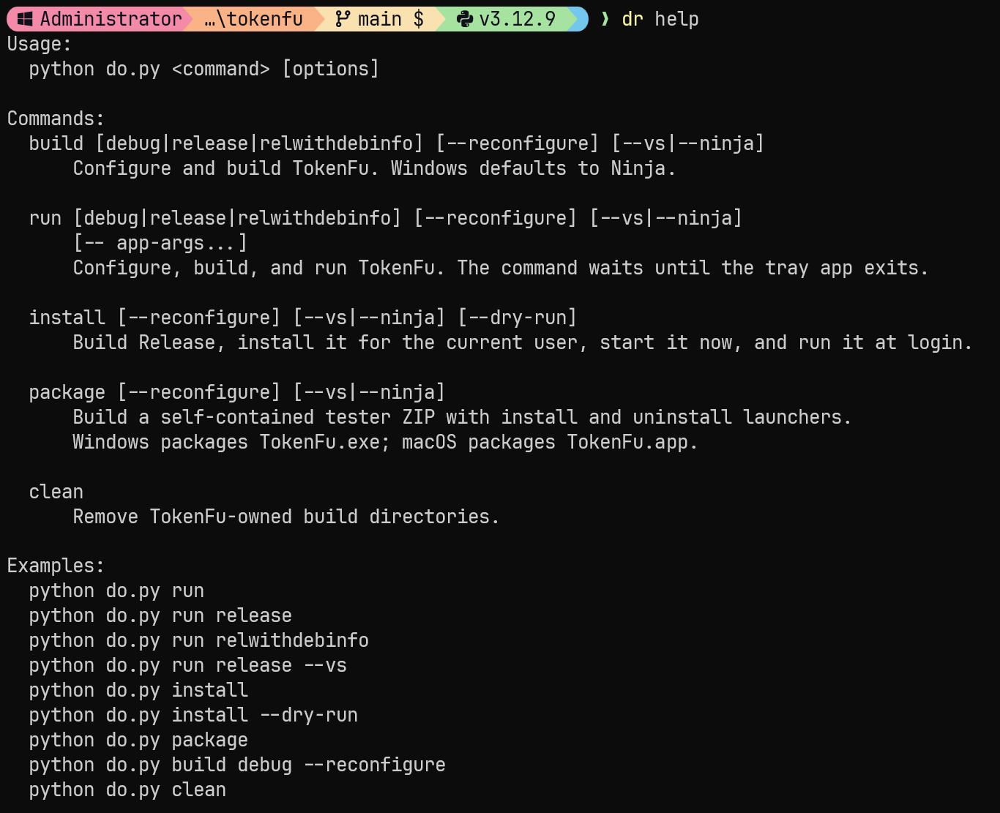{.slide-image fig-alt="Tool friction"}

## `plans/`

:::: {.columns}

::: {.column width="40%"}

```text
plans/
├── manifesto.md
├── feature-plan.md
├── architecture.md
└── decisions.md
```

:::

::: {.column width="70%"}

- Plans are Markdown
- `manifesto.md` is the soul
- "Agent: write this into a plan file"

:::

::::

## Auto Multi-Agent Code Reviews

Three agents review the same codebase independently:

```
plans/reviews/
├── review-latest.claude.md
├── review-latest.gemini.md
├── review-latest.gpt.md
└── review-consensus.md       ← synthesized
```

- Each agent finds different classes of issues
- The consensus step combines the results and files kanban issues

## Review Flow

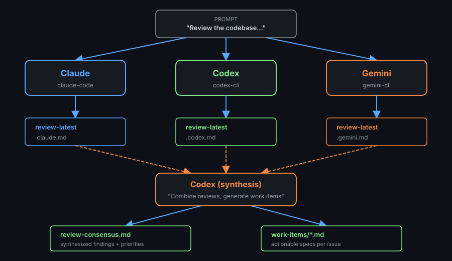

## Review Skill

- `"$review ...Look at the separation of modules and the general layout. Look for bad code smells, or things that will make it harder for multiple agents to work on the codebase. Do a thorough review. Look for testing holes, and for code that is not clean or easy to maintain. Look for opportunities to separate concerns and make things modular..."`

## Planning: Vertical Slices

- After automated reviewer, or manual

<br>
<div class="checkpoint-strip">
  <div class="checkpoint"><strong>Plan</strong>Break a task into slices<span class="check">✓ Pass Criteria</span></div>
  <div class="checkpoint"><strong>Test</strong>One visible outcome<span class="check">✓ Does it work?</span></div>
  <div class="checkpoint"><strong>Refine</strong>Tweaks, Tangents<span class="check">✓ Don't accept debt?</span></div>
  <div class="checkpoint"><strong>Ship</strong>Commit it, move on<span class="check">✓ Done</span></div>
</div>
</br>

## Planning: Vertical Slices
{.slide-image fig-alt="Kanban"}

## Planning: Kanban

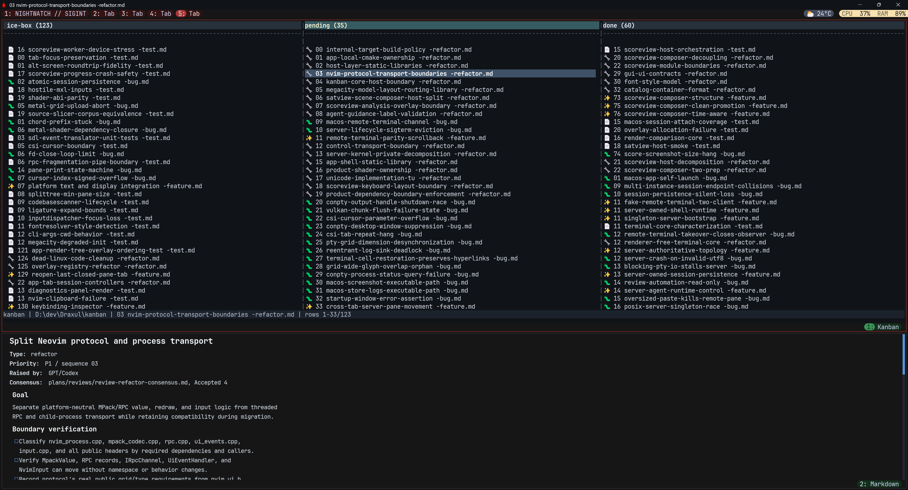{.slide-image fig-alt="Kanban"}

## Planning: Kanban

- Kanban: pending, done, ice-box
- Goodbye Jira
- Fast, Markdown, easy
- "Go implement 3, 5, 6 with parallel agents"
- "Fix all the bugs in pending with parallel agents"
- Agent updates the markdown too

## Code Inspection

- Interrogate the agent daily (hourly?)
- It lies by omission
- It cheats
- "How does this work?"
- "Why is this slow?"
- "How would you improve this?"

## Vibe: Quick Prototypes and Features

- Vibe a solution, then plan it properly
- Test the risky idea first
- Throw it away without regret

## Monolith (??)

- Building everything in one executable
- (My terminal emulator can view satellite data and play music...??)
- Keeps the agent honest - more refactoring

## Cross Platform

- Always works on Mac and PC
- And with Metal / Vulkan - 2 different GPU APIs!
- Keeps the agent honest - less shortcuts

## Tooling speeds

- Testing, Smoke, etc. is important at speed
- Spend time and energy on optimizing your build
- Agents are insanely good at this

## Dog Food

- Use what you build
- Be honest about what works
- Fix it immediately
- Work cross platform

## Motivation

## {.motivational-image-slide}

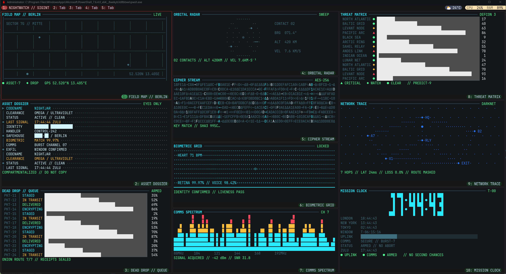{.motivation-shot fig-alt="A dense terminal dashboard showing maps, orbital radar, secure communications, and live system status"}

## {.motivational-image-slide}

{.motivation-shot fig-alt="A terminal-based Kanban board with work moving from the icebox through pending to done"}

## {.motivational-image-slide}

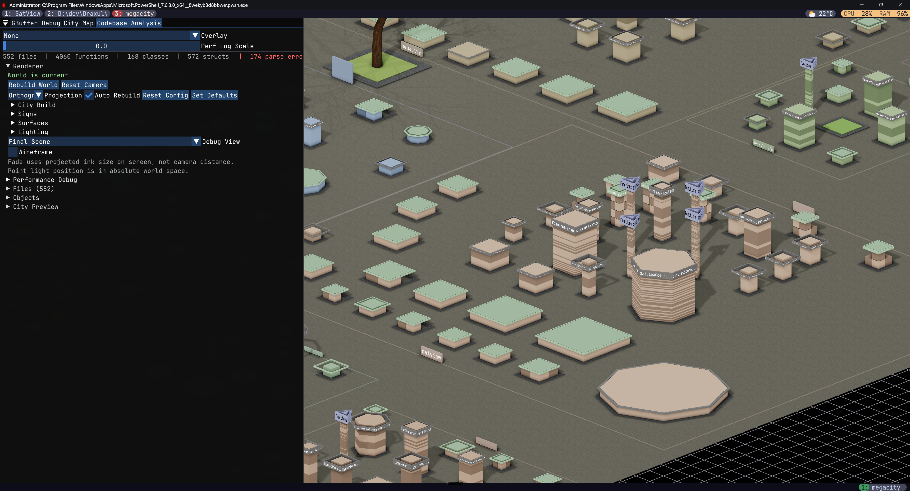{.motivation-shot fig-alt="A code analysis tool visualizing a software project as a three-dimensional city"}

## {.motivational-image-slide}

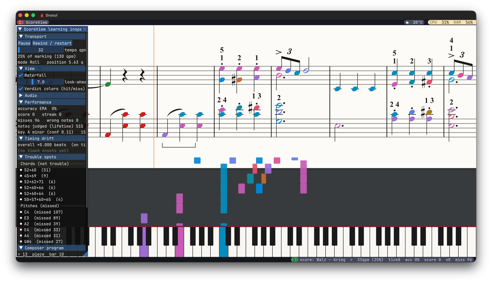{.motivation-shot fig-alt="A music-learning application combining sheet music, note feedback, and a piano keyboard"}

## {.motivational-image-slide}

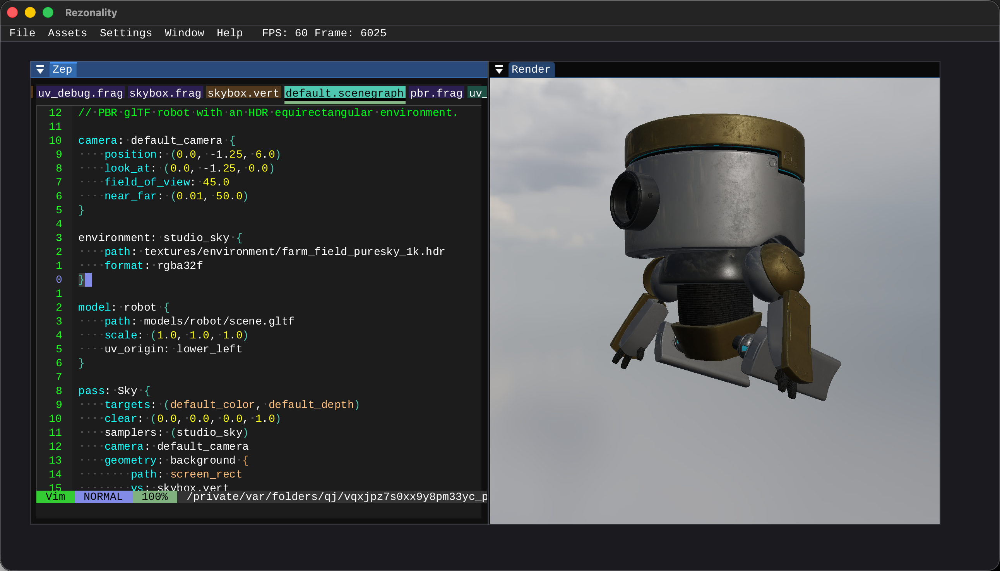{.motivation-shot fig-alt="A custom graphics editor showing scene code beside a rendered robot"}

## {.motivational-image-slide}

{.motivation-shot fig-alt="A satellite visualization of Earth surrounded by orbital objects and constellation boundaries"}

## {.motivational-image-slide}

<div class="ios-showcase" aria-label="Three iOS applications: a fasting tracker, a timing puzzle game, and a 3D sculpting tool">
  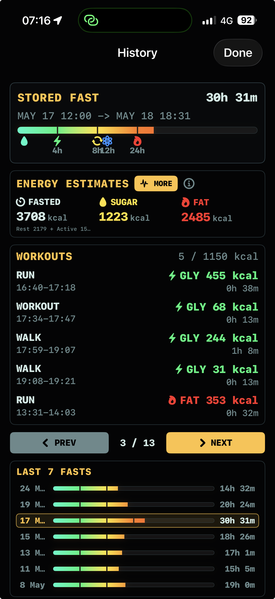
  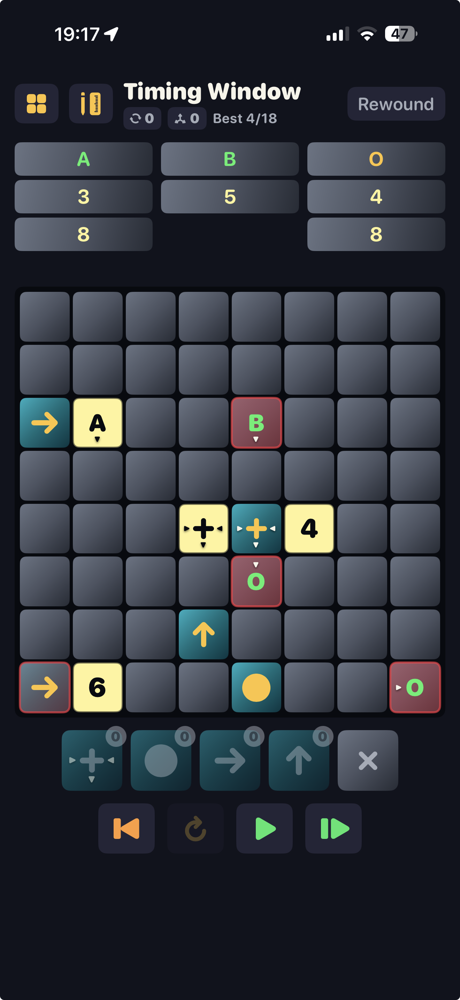
  
</div>

## {.motivational-image-slide}

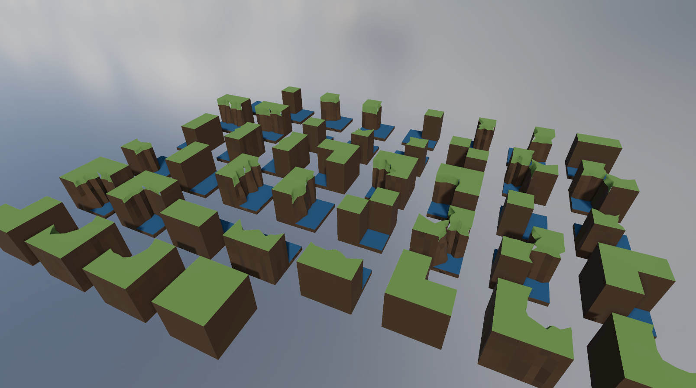{.motivation-shot fig-alt="An early real-time strategy terrain experiment built from separate procedural land tiles"}

## {.motivational-image-slide}

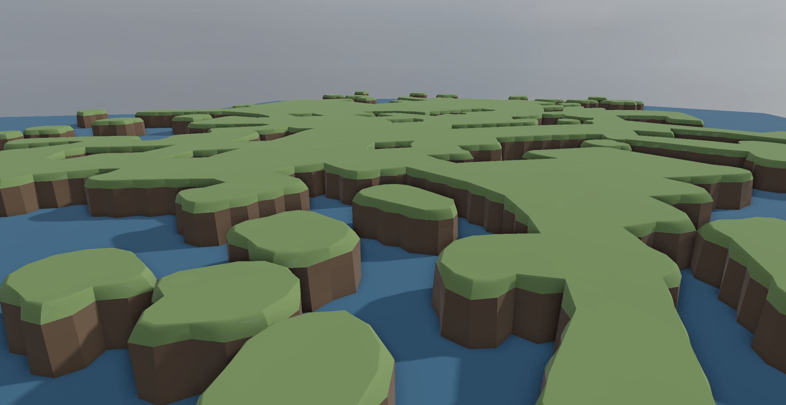{.motivation-shot fig-alt="A developed real-time strategy terrain rendered as a continuous low-poly landscape"}

## {.motivational-image-slide}

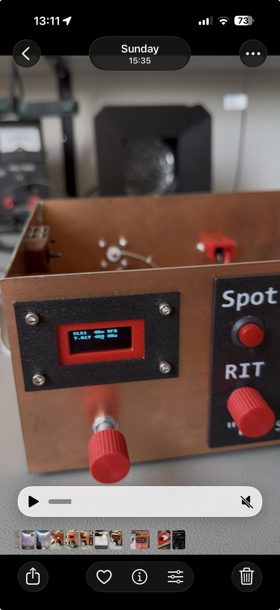{.motivation-shot .portrait fig-alt="A hand-built VFO electronics project with a display, controls, and 3D-printed parts"}

## {.motivational-image-slide}

```{=html}
<video class="motivation-video" autoplay loop muted playsinline aria-label="Animated visualization of token use">
  <source src="screenshots/tokenanim.mp4" type="video/mp4">
</video>
```

## {.motivational-image-slide}

```{=html}
<video class="motivation-video landscape-video" autoplay loop muted playsinline aria-label="A software synthesizer in action">
  <source src="screenshots/synth.mp4" type="video/mp4">
</video>
```

## Thanks! {.thanks-slide}
